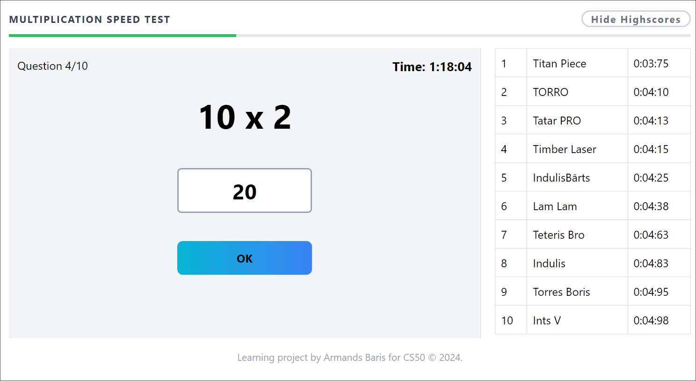
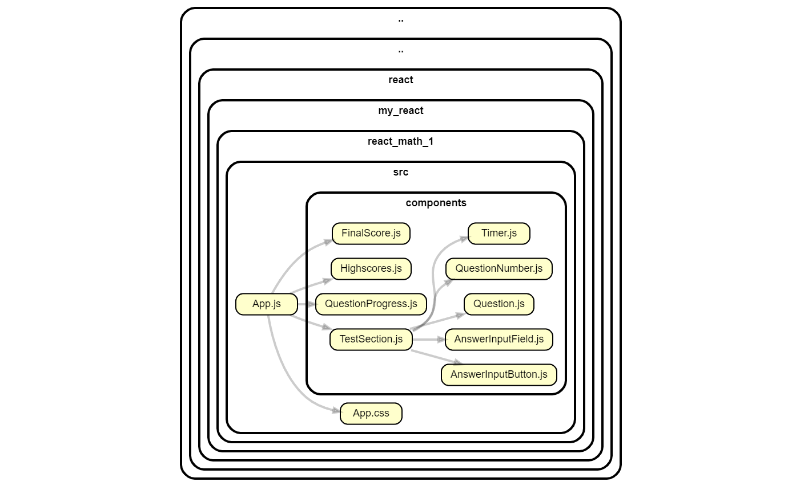
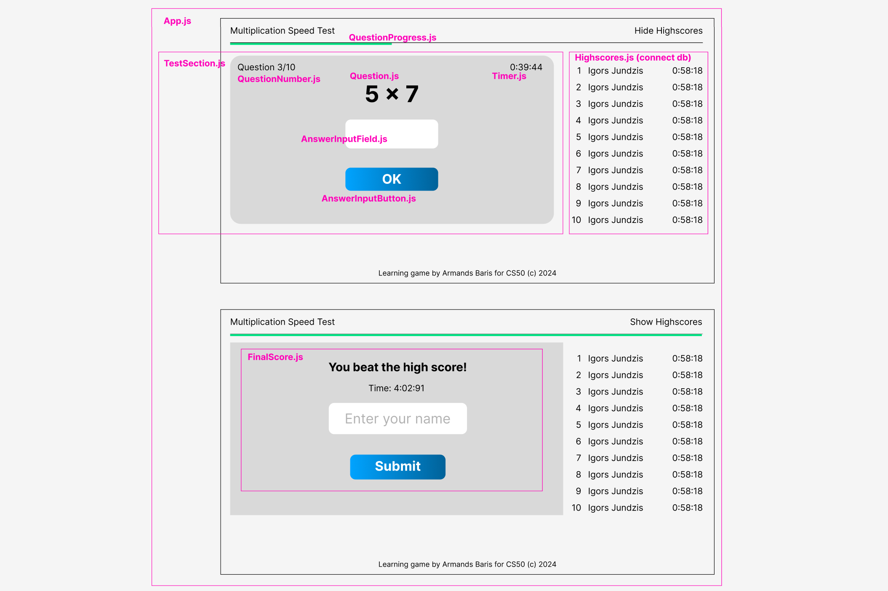

# Multiplication Speed Test

This is my final project to conclude the CS50 Introduction to Computer Science course.

**Working project: https://speedtest.glaive.pro**

## About the project



Multiplication Speed Test is a web-based application created to help users practice multiplication tables with numbers 1 to 10.

This web app is best suited for children who need to learn the multiplication table. It gradually enhances multiplication skills, improves speed and accuracy.

The highscores table provides additional motivational element - to compete and therefore achieve proficiency via gamification. Task is to answer all 10 math questions as fast as possible. Time is measured up to miliseconds.

The project is made with VS Code using technology stack: React + Tailwind + SQLite.

Video demo: https://youtu.be/6rKW-TVTDNc

## Installation

### Prerequisites

Make sure you have the following installed:

-   Node.js
-   npm
-   Sqlite

### Steps

1. Clone the repository:

    ```shell
    git clone https://github.com/armanc/multiplication-speed-test.git
    ```

2. Navigate to the project directory:

    ```shell
    cd multiplication-speed-test
    ```

3. Install the dependencies:
    ```shell
    npm install
    ```

## Usage

1. Start the database:

    ```shell
    node db_server.js
    ```

2. Start the development server:

    ```shell
    npm start
    ```

3. Open your web browser and go to http://localhost:3000

## Technical Details

### Technologies Used

-   React: A JavaScript library for building dynamic user interfaces (https://reactjs.org/).
    It allows application to be completely modular. This application consists of 9 components. Key components are wrapped in TestSection.js component to manage the test's base logic unified. Here is visual diagram of dependencies (Created via Dependencies Cruiser Extension for VS Code):

    

    And here is preview of how these components align visually:

    

-   Tailwind CSS: A utility-first CSS framework for rapid UI development (https://tailwindcss.com/). It enables direct styling through the use of class names.
-   SQLite: Library that provides a lightweight, disk-based database (https://www.sqlite.org/). I used it to create table to save highscores. Table consists of id, name and time.
-   VS Code: Code editor used to put it all together.
-   Figma: Interface design tool. Used for prototyping to make clear how interface should look and function before writing any code.
